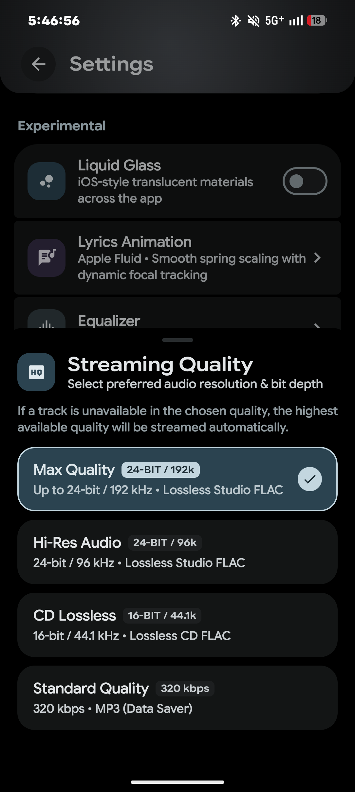
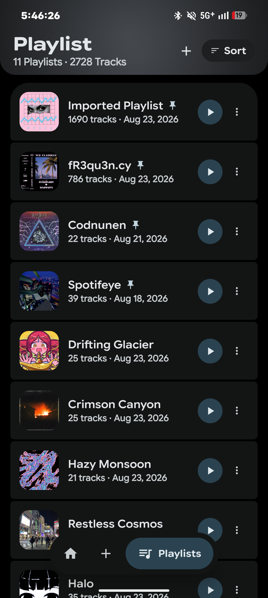

<div align="center">


# ECHO

**Next-Gen YouTube Music Client with Algorithmic Smart Playlist Generator, Real-Time Synced Lyrics & Universal Last.fm Scrobbler for Android.**

<p align="center">
  <a href="#">
    
  </a>
  <a href="#">
    
  </a>
  <a href="#">
    
  </a>
  <a href="#">
    
  </a>
  <a href="#">
    
  </a>
</p>

</div>

<br/>

<div align="center">
  
  
  
  <br/>
  <br/>
  
  
  
</div>

<br/>

## 🌟 Overview

**ECHO** is a modern, high-fidelity native Android music streaming player powered by the **YouTube Music** catalog and **Last.fm** scrobbler integration. Designed with **Material 3 Expressive**, ECHO provides seamless ad-free audio playback, intelligent playlist algorithms, millisecond-accurate synchronized lyrics, bit-perfect USB audio support, and effortless background listening.

Developed and maintained as an open-source project by **Akash** (**Made by Akash**).

---

## ⚡ Key Features

| Feature | Description |
|:---|:---|
| **YouTube Music Streaming** | Stream millions of tracks, albums, artists, and community playlists directly via YouTube Music with zero interruptions, background play, and cache optimization. |
| **Universal Last.fm Scrobbler** | Native background scrobbler that tracks your listening history to Last.fm seamlessly with minimal battery overhead. |
| **Real-Time Synced Lyrics** | Millisecond-accurate synchronized karaoke lyrics powered by LRCLIB with fluid physics animations and customization. |
| **Smart Playlist Generator** | Algorithmic taste mixes, artist radios, and mood-based smart collections derived from your listening trends. |
| **Bit-Perfect Audio Engine** | Low-latency audio rendering with AndroidX Media3 ExoPlayer, FFmpeg software decoders, and Decent USB audio driver for audiophile DACs. |
| **Offline Cache & Downloads** | Download and cache high-quality audio files with embedded ID3 tags, album art, and synchronized `.lrc` lyrics. |
| **Material 3 Expressive UI** | Modern dark and light theming, dynamic wallpaper extraction, fluid animations, and responsive layouts across phones, foldables, and tablets. |
| **Playlist Importer** | Effortlessly import playlists from Spotify, Apple Music, and YouTube into your personal ECHO library. |

---

## 🛠️ Architecture & Tech Stack

- **Language:** 100% Kotlin
- **UI Toolkit:** Jetpack Compose with Material 3 Expressive
- **Audio Playback:** AndroidX Media3 (ExoPlayer 1.2.1), Jellyfin FFmpeg software decoders, Oboe native audio output
- **Streaming Client:** YouTube Music API client with InnerTube & NewPipeExtractor fallbacks
- **Tracking & Scrobbling:** Last.fm REST API with MediaSessionCompat monitoring
- **Local Persistence:** Room Database + Jetpack DataStore Preferences
- **Dependency Injection:** Dagger Hilt
- **Asynchronous Flow:** Kotlin Coroutines & StateFlow

---

## 🚀 Quick Start & Installation

### Option 1: Direct APK Install
1. Head over to the **[Releases](https://github.com/akashtiwari1227/ECHO/releases)** page.
2. Download the latest `ECHO-v4.2.0-release.apk`.
3. Open the file on your Android device (Android 7.0 / API 24 or newer) and tap **Install**.
4. (Optional) In **Settings → Integrations**, connect your Last.fm account to activate live scrobbling and taste radios.

For comprehensive installation instructions, building from source, ADB sideloading, and signing keys, see **[INSTALLATION.md](INSTALLATION.md)**.

For accessibility features, screen reader guidance, and display customization, see **[ACCESSIBILITY.md](ACCESSIBILITY.md)**.

---

## 💻 Building from Source

Ensure you have Android Studio (Koala or newer) and JDK 17+ installed:

```bash
# 1. Clone the repository
git clone https://github.com/akashtiwari1227/ECHO.git
cd ECHO

# 2. Grant execution permission to Gradle wrapper
chmod +x gradlew

# 3. Build debug APK
./gradlew assembleDebug

# 4. Or build release APK
./gradlew assembleRelease
```

The compiled APK will be generated at `app/build/outputs/apk/debug/app-debug.apk`.

---

## 🔒 Security & Privacy

ECHO is designed with zero-telemetry and privacy-first principles:
- No personal user data is collected or transmitted to private third-party servers.
- Secrets, credentials, and token handshakes are verified locally and encrypted.
- Communication with YouTube Music and Last.fm occurs over verified HTTPS/TLS endpoints.
- Read our full policy in **[SECURITY.md](SECURITY.md)**.

---

## 🤝 Contributing

Contributions, bug reports, and feature suggestions are warmly welcomed! Please read **[CONTRIBUTING.md](CONTRIBUTING.md)** and our **[CODE_OF_CONDUCT.md](CODE_OF_CONDUCT.md)** before opening pull requests.

---

## ⚖️ License & Disclaimer

ECHO is licensed under the **GNU General Public License v3.0 (GPL-3.0)**. See **[LICENSE](LICENSE)** for details.

> **Disclaimer:** ECHO is an open-source, non-commercial media player application designed for research and educational purposes. ECHO is not affiliated with, endorsed, or sponsored by Google LLC, YouTube, YouTube Music, or Last.fm. All trademarks and copyrighted materials belong to their respective owners.

---

<div align="center">
  <p><b>ECHO</b> is developed with ❤️ by <b>Made by Akash</b>.</p>
</div>
